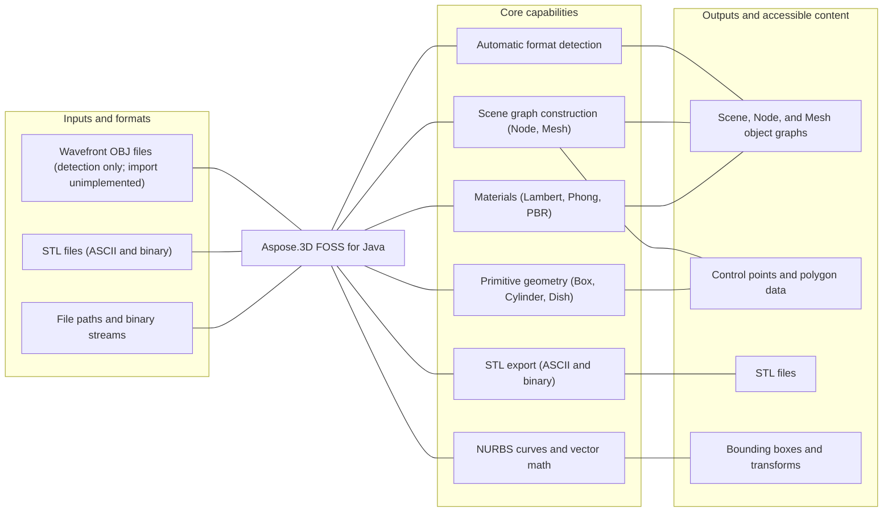

# Aspose.3D FOSS for Java

[](https://repo1.maven.org/maven2/org/aspose/aspose-3d-foss/) [](https://openjdk.org/projects/jdk/21/) [](LICENSE) [](https://github.com/aspose-3d-foss/Aspose.3D-FOSS-for-Java/graphs/contributors)

Aspose.3D FOSS for Java is a free, open-source Java library for working with 3D scenes and
meshes through an Aspose.3D-compatible API. It builds and traverses a scene graph of nodes,
meshes, curves, and materials, detects 3D file formats automatically, and reads and writes
the formats implemented in this edition.

## Navigation

- [At a glance](#at-a-glance)
- [Key capabilities](#key-capabilities)
- [Installation](#installation)
- [Quick start](#quick-start)
- [Additional examples](#additional-examples)
- [API reference](#api-reference)
- [Documentation & resources](#documentation--resources)
- [Scope and limitations](#scope-and-limitations)
- [Development and testing](#development-and-testing)
- [License](#license)

## At a glance



## Key capabilities

- Detect a 3D file's format automatically, or resolve an explicit format from a file path or binary stream (`FileFormat.detect`, `FileFormat.getFormatByExtension`). Of the formats this edition can detect, only STL currently loads real scene content — see [Scope and limitations](#scope-and-limitations).
- Build a scene graph from scratch: `Scene`, `Node.createChildNode`, and `Mesh` with control points and polygons.
- Construct parameterized primitives such as `Box`, `Cylinder`, and `Dish`, and IFC-style profiles such as `CircleShape` and `EllipseShape`.
- Apply materials — `LambertMaterial`, `PhongMaterial`, and `PbrMaterial` — with configurable colors, transparency, and reflection.
- Work with `NurbsCurve` (degree, order, knot vectors, control points) and composite curve types.
- Use the `Vector2`/`Vector3`/`Vector4`, `Matrix4`, and `BoundingBox` math utilities that back the scene graph.
- Export to STL in ASCII or binary form (`StlSaveOptions`), and read STL back with `StlLoadOptions`.

## Installation

Add the dependency to your `pom.xml`:

```xml
<dependency>
  <groupId>org.aspose</groupId>
  <artifactId>aspose-3d-foss</artifactId>
  <version>26.5.0</version>
</dependency>
```

Gradle (Groovy DSL):

```groovy
implementation 'org.aspose:aspose-3d-foss:26.5.0'
```

The library targets Java 21 and has no third-party runtime dependencies.

## Quick start

Load an STL file and re-save it in an explicit STL representation — format is detected
automatically for the load:

```java
import com.aspose.threed.FileFormat;
import com.aspose.threed.Scene;

Scene scene = Scene.fromFile("input/cube.stl");
scene.save("output.stl", FileFormat.STLASCII);
```

Build a scene from scratch and export it to STL:

```java
import com.aspose.threed.Mesh;
import com.aspose.threed.Node;
import com.aspose.threed.Scene;

Scene scene = new Scene();
Mesh mesh = new Mesh("TestMesh");

mesh.addControlPoint(0, 0, 0);
mesh.addControlPoint(1, 0, 0);
mesh.addControlPoint(0, 1, 0);
mesh.addControlPoint(0, 0, 1);

mesh.createPolygon(new int[]{0, 1, 2});
mesh.createPolygon(new int[]{0, 1, 3});
mesh.createPolygon(new int[]{0, 2, 3});
mesh.createPolygon(new int[]{1, 2, 3});

scene.getRootNode().createChildNode("TestNode", mesh);
scene.save("output.stl");
```

## Additional examples

Every example below is exercised by the project's own test suite. See the
[`src/test/java/com/aspose/threed`](https://github.com/aspose-3d-foss/Aspose.3D-FOSS-for-Java/tree/master/src/test/java/com/aspose/threed)
tests for the full set.

### Save in an explicit format or with save options

```java
import com.aspose.threed.FileFormat;
import com.aspose.threed.Scene;
import com.aspose.threed.StlSaveOptions;

scene.save("output.stl", FileFormat.STLASCII);

// ...or with save options
scene.save("output.stl", new StlSaveOptions());
```

<details>
<summary>View additional examples</summary>

### Detect a format from a stream and load it

```java
FileInputStream stream = new FileInputStream(new File("testdata/input/cube.stl"));
Scene scene = new Scene();
FileFormat format = FileFormat.getFormatByExtension(".stl");
scene.open(Stream.wrap(stream), format);
stream.close();

Node node = scene.getRootNode().getChildNodes().get(0);
Mesh mesh = (Mesh) node.getEntities().get(0);
System.out.println(mesh.getControlPoints().size());
System.out.println(mesh.getPolygonCount());
```

### Build and inspect a scene graph

```java
Scene scene = new Scene();
Node node = scene.getRootNode().createChildNode("TestNode");
System.out.println(node.getName());
System.out.println(scene.getRootNode().getChildNodes().size());
```

### Read and set a node's transform

```java
Node node = scene.getRootNode().createChildNode("TestNode");
Vector3 translation = node.getTransform().getTranslation();
node.getTransform().setTranslation(new Vector3(1, 2, 3));
```

### Create and inspect materials

```java
import com.aspose.threed.LambertMaterial;
import com.aspose.threed.Vector3;

LambertMaterial material = new LambertMaterial("Body");
material.setDiffuseColor(new Vector3(0.8, 0.2, 0.2));
material.setAmbientColor(new Vector3(0.1, 0.1, 0.1));
material.setTransparency(0.0);
```

```java
import com.aspose.threed.PbrMaterial;

PbrMaterial pbr = new PbrMaterial();
pbr.setAlbedo(new Vector3(1, 1, 1));
pbr.setMetallicFactor(0.5);
pbr.setRoughnessFactor(0.3);
```

### Construct a NURBS curve

```java
import com.aspose.threed.CurveDimension;
import com.aspose.threed.NurbsCurve;
import com.aspose.threed.NurbsType;

NurbsCurve curve = new NurbsCurve();
curve.setOrder(4);
System.out.println(curve.getDegree());
System.out.println(curve.getDimension());
System.out.println(curve.getCurveType());
```

### Vector3 math

```java
import com.aspose.threed.Vector3;

Vector3 a = new Vector3(1, 0, 0);
Vector3 b = new Vector3(0, 1, 0);
Vector3 sum = Vector3.add(a, b); // add is static; dot/cross below are instance methods
double dot = a.dot(b);
Vector3 cross = a.cross(b);
```

</details>

## API reference

The public entry point is `com.aspose.threed.*`, matching the package structure of the
commercial Aspose.3D for Java library. The classes below cover the most commonly used parts
of the surface.

<details>
<summary>View the supported public API surface</summary>

### Scene graph

- `Scene`
  - `Scene()`, `fromFile(path) -> Scene`, `open(stream, format)`
  - `getRootNode() -> Node`
  - `save(path)`, `save(path, format)`, `save(path, options)`
  - `getName() -> String`
- `Node` (extends `A3DObject`)
  - `createChildNode(name)`, `createChildNode(name, entity)`
  - `getChildNodes() -> List<Node>`
  - `getEntities() -> List<Entity>`
  - `getTransform() -> Transform`
- `Mesh`
  - `addControlPoint(x, y, z)`
  - `createPolygon(indices)`
  - `getControlPoints() -> ...`, `getPolygonCount() -> int`

### Primitives and profiles

- `Box`, `Cylinder`, `Dish` — parameterized solid primitives with `toMesh() -> Mesh`
- `CircleShape`, `EllipseShape` (extend `ParameterizedProfile`) — IFC-compatible 2D profiles
- `BooleanOperator`, `BooleanOperand`, `BooleanOperation` — mesh boolean add/subtract/intersect

### Materials

- `Material` (base)
- `LambertMaterial` — `getDiffuseColor/setDiffuseColor`, `getAmbientColor/setAmbientColor`, `getEmissiveColor/setEmissiveColor`, `getTransparency/setTransparency`
- `PhongMaterial` — adds `getSpecularColor/setSpecularColor`, `getShininess/setShininess`, `getReflectionFactor/setReflectionFactor`
- `PbrMaterial` — `getAlbedo/setAlbedo`, `getMetallicFactor/setMetallicFactor`, `getRoughnessFactor/setRoughnessFactor`, `getOcclusionFactor/setOcclusionFactor`, `fromMaterial(material) -> PbrMaterial`

### Curves

- `Curve` (abstract base), `Circle`, `Ellipse`, `CompositeCurve`
- `NurbsCurve` — `getDegree/setDegree`, `getOrder/setOrder`, `getControlPoints`, `getKnotVectors`, `getMultiplicity`, `getRational/setRational`, `getCurveType/setCurveType`

### Math and geometry

- `Vector2`, `Vector3`, `Vector4` — `add`, `dot`, `cross`, component accessors
- `Matrix4` — transform matrices
- `BoundingBox`, `BoundingBox2D` — `getMinimum`, `getMaximum`, `getCenter`, `getSize`, `merge`, `contains`
- `Transform` — `getTranslation/setTranslation`

### File I/O

- `FileFormat` — `detect(stream, fileName)`, `getFormatByExtension(path)`, `getCanImport()`, `getCanExport()`, format constants (`WAVEFRONTOBJ`, `STL_BINARY`, `STLASCII`, and others)
- `StlLoadOptions`, `StlSaveOptions` — `getFlipCoordinateSystem/setFlipCoordinateSystem`
- `LoadOptions`, `SaveOptions` (bases for all format-specific options)

### Enums

- `Axis`, `CoordinateSystem`, `BoneLinkMode`, `BooleanOperation`, `DracoCompressionLevel`, `ApertureMode`, `BindPoint`

The full surface totals 195 public classes. See the [full API reference](#documentation--resources)
below for every type.

</details>

## Documentation & resources

- **[Getting started guide](https://docs.aspose.org/3d/java/)** — installation, walkthroughs, and feature guides for this library.
- **[How-to guides & FAQ](https://kb.aspose.org/3d/java/)** — task-focused answers for common 3D-processing questions.
- **[Full API reference](https://reference.aspose.org/3d/java/)** — the complete, browsable reference for all 195 public classes.
- **[FILE_FORMATS.md](FILE_FORMATS.md)** — per-format support status in this repository.
- **[TODO.md](TODO.md)** — current porting progress and planned work.
- Found a bug or have a feature request? [Open an issue](https://github.com/aspose-3d-foss/Aspose.3D-FOSS-for-Java/issues) on GitHub.

## Scope and limitations

STL import and export (ASCII and binary) are the only fully functional read/write path in this
edition. **Wavefront OBJ import does not currently work despite being format-detectable**:
`FileFormat.detect`/`FileFormat.getFormatByExtension` correctly identify `.obj` files, but the
internal OBJ reader that `Scene.fromFile`/`Scene.open` dispatch to is an unimplemented stub in
the published `26.5.0` jar — it returns an empty `Scene` with no exception and no nodes, entities,
or control points, regardless of the input file's content.
The current GitHub source tree contains a real line-based OBJ parser, so this is a shipped-vs-source
drift rather than a documented limitation — track the upstream issue tracker for a fix. Save
options classes exist for other formats (Collada, glTF, FBX-family, AMF, Draco, and more) but
their encoders are not yet wired up in this FOSS build. Draco encoding and decoding explicitly throw
`UnsupportedOperationException`, as does `Scene.render` (no rendering pipeline), `Camera.moveForward`,
and the cryptographic and licensing/metering helpers, which are not applicable to an open-source
edition. `toMesh()` conversion is not implemented for a few parametric primitives
(`Pyramid`, `Torus`, `RectangularTorus`, `RevolvedAreaSolid`, `LinearExtrusion`).

For rendering, the broader exchange-format set (FBX, glTF, USD, PDF, JT, and more), and advanced
mesh operations, see [Aspose.3D for Java Enterprise Edition](https://products.aspose.com/3d/java/).

## Development and testing

This is a Maven project targeting Java 21. Build and test from source:

```bash
mvn clean package
mvn test
```

## License

This project is licensed under the [MIT License](LICENSE). The MIT License permits use, copying,
modification, distribution, sublicensing, and commercial use, provided its copyright and
permission notice are retained. The software is provided without warranty.
