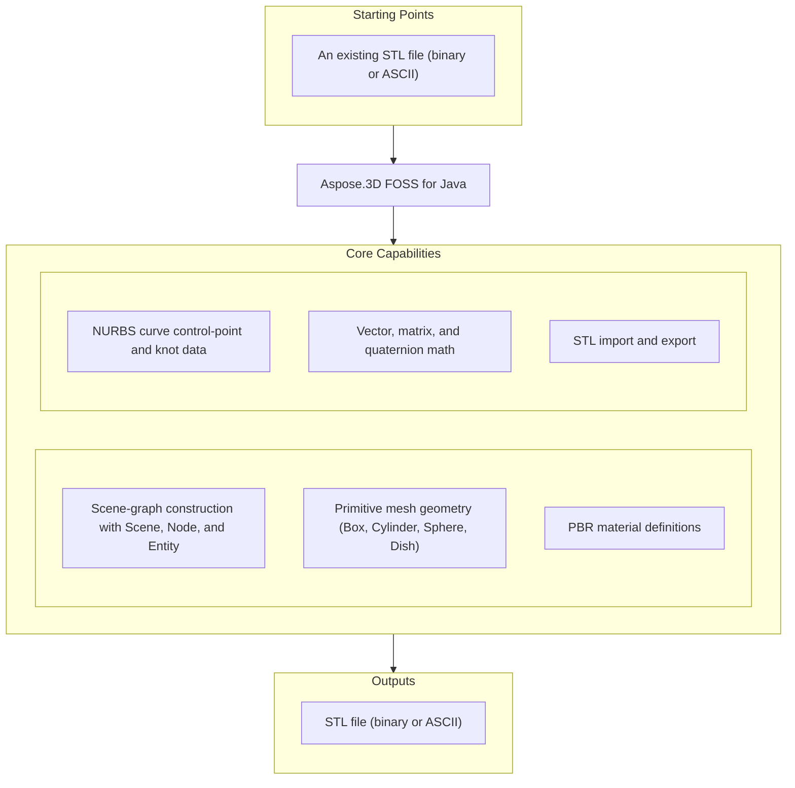

# Aspose.3D FOSS for Java

[](https://repo1.maven.org/maven2/org/aspose/aspose-3d-foss/) [](https://openjdk.org/projects/jdk/21/) [](LICENSE) [](https://github.com/aspose-3d-foss/Aspose.3D-FOSS-for-Java/graphs/contributors)

[](https://products.aspose.org/3d/java/)

Aspose.3D FOSS for Java is a free, open-source, MIT-licensed Java library for building and
inspecting 3D scenes. About Aspose.3D FOSS: it is built as a clean-room implementation for API
compatibility with the commercial library, exposing the same `com.aspose.threed.*` package,
method signatures, and class names around a scene graph for organizing cameras and transforms.
Aspose.3D FOSS — free & open source (aspose.org) — is part of the wider Aspose.3D product family,
also available for Python, .NET, and TypeScript. Aspose.3D — commercial On-Premise edition
(aspose.com) — adds the broader functionality described in
[Scope and Limitations](#scope-and-limitations).

## Navigation

- [At a Glance](#at-a-glance)
- [Key Capabilities](#key-capabilities)
- [Installation](#installation)
- [Dependencies](#dependencies)
- [Quick Start](#quick-start)
- [Additional Examples](#additional-examples)
- [API Reference](#api-reference)
- [Documentation & Resources](#documentation--resources)
- [Scope and Limitations](#scope-and-limitations)
- [Development and Testing](#development-and-testing)
- [License](#license)

## At a Glance



## Key Capabilities

- Build a 3D scene graph with `Scene`, `Node`, and `Entity`, attaching geometry through `Node.addEntity`/`Node.createChildNode` and organizing it into a parent-child hierarchy.
- Detect a 3D file's format automatically, or resolve an explicit format from a file path or
  binary stream (`FileFormat.detect`, `FileFormat.getFormatByExtension`).
- Generate primitive solids as ready-to-use geometry — `Box`, `Cylinder`, `Sphere`, and `Dish` each implement `toMesh()` to produce a `Mesh` — and IFC-style 2D profiles such as `CircleShape` and `EllipseShape`.
- Define materials with `LambertMaterial`, `PhongMaterial`, and `PbrMaterial` — albedo, metallic/roughness, occlusion, and emissive channels, plus texture references — and assign them per node via `Node.setMaterial`.
- Model NURBS curves through `NurbsCurve`, exposing control points, knot vectors, and degree/order data (curve sampling is not implemented; see [Scope and Limitations](#scope-and-limitations)).
- Work with the transform and geometry math that underlies every scene operation — `Vector2`/`Vector3`/`Vector4`, `Matrix4`, `Quaternion`, and `BoundingBox`.
- Import and export STL geometry (binary or ASCII) with `StlLoadOptions`/`StlSaveOptions`, dispatched through `Scene.fromFile`/`Scene.save` — the one format that is fully functional end to end in the published package (see [Scope and Limitations](#scope-and-limitations)).

## Installation

Aspose.3D FOSS for Java is published to Maven Central as `org.aspose:aspose-3d-foss`. Add it to
your project as a dependency — no extra repositories or configuration required.

Maven:

```xml
<dependency>
    <groupId>org.aspose</groupId>
    <artifactId>aspose-3d-foss</artifactId>
    <version>26.5.0</version>
</dependency>
```

Gradle (Kotlin DSL):

```kotlin
implementation("org.aspose:aspose-3d-foss:26.5.0")
```

Gradle (Groovy DSL):

```groovy
implementation 'org.aspose:aspose-3d-foss:26.5.0'
```

Other build tools that resolve dependencies from Maven Central — SBT, Apache Ivy, Leiningen, and
similar — can use the same `org.aspose:aspose-3d-foss:26.5.0` coordinates. Requires Java 21 or
later.

## Dependencies

### Required Package Dependencies

No required third-party package dependencies.

### Native and System Requirements

- Requires Java 21 or later, per `pom.xml`'s `maven.compiler.target`/`maven.compiler.source`.
- No native/system libraries beyond the JVM itself.

### Development Dependencies

- `org.junit.jupiter:junit-jupiter` — the JUnit 5 test framework, used only by the test suite.

## Quick Start

Typical usage: load a 3D file and convert it to another format:

```java
import com.aspose.threed.Scene;

// Load an STL file (format is detected automatically)
Scene scene = Scene.fromFile("input/cube.stl");

// Save it back out
scene.save("output.stl");
```

To explicitly specify the output format, or load with custom save options:

```java
import com.aspose.threed.FileFormat;
import com.aspose.threed.Scene;
import com.aspose.threed.StlSaveOptions;

Scene scene = Scene.fromFile("input/cube.stl");

// Save in an explicit format
scene.save("output.stl", FileFormat.STLASCII);

// ...or with save options
scene.save("output.stl", new StlSaveOptions());
```

## Additional Examples

A few more common operations, built directly from the library's own scene-graph and geometry
APIs, are collected below.

### Build a Scene From a Primitive

```java
import com.aspose.threed.Box;
import com.aspose.threed.Scene;

Scene scene = new Scene();
Box box = new Box(2.0, 2.0, 2.0);
scene.getRootNode().createChildNode("box", box);
scene.save("box.stl");
```

<details>
<summary>View Additional Examples</summary>

### Assign a PBR Material

```java
import com.aspose.threed.Node;
import com.aspose.threed.PbrMaterial;
import com.aspose.threed.Scene;
import com.aspose.threed.Vector3;

Scene scene = Scene.fromFile("input/cube.stl");
Node node = scene.getRootNode().getChildNodes().get(0);

PbrMaterial material = new PbrMaterial();
material.setAlbedo(new Vector3(0.8, 0.2, 0.2));
material.setMetallicFactor(0.1);
material.setRoughnessFactor(0.6);
node.setMaterial(material);

scene.save("output.stl");
```

### Define a NURBS Curve's Control Points

```java
import com.aspose.threed.NurbsCurve;
import com.aspose.threed.Vector4;

NurbsCurve curve = new NurbsCurve("profile");
curve.setDegree(3);
curve.getControlPoints().add(new Vector4(0, 0, 0, 1));
curve.getControlPoints().add(new Vector4(1, 2, 0, 1));
curve.getControlPoints().add(new Vector4(2, 0, 0, 1));
```

### Detect a Format From a Stream and Load It

```java
import com.aspose.threed.FileFormat;
import com.aspose.threed.Scene;
import com.aspose.threed.Stream;

FileInputStream stream = new FileInputStream(new File("input/cube.stl"));
Scene scene = new Scene();
FileFormat format = FileFormat.getFormatByExtension(".stl");
scene.open(Stream.wrap(stream), format);
stream.close();
```

### Read and Set a Node's Transform

```java
import com.aspose.threed.Node;
import com.aspose.threed.Vector3;

Node node = scene.getRootNode().createChildNode("TestNode");
Vector3 translation = node.getTransform().getTranslation();
node.getTransform().setTranslation(new Vector3(1, 2, 3));
```

</details>

## API Reference

`Scene` is the central entry point: `Scene.fromFile` loads geometry with automatic format
detection, `getRootNode()` exposes the scene graph for building or traversal, and `Scene.save`
writes it back out. The full 266-type public surface is listed below by module, with curated
detail following for the classes used most often.

<details>
<summary>View the Supported Public API Surface</summary>

### Core API

| Class | Description |
|---|---|
| `A3DObject` | A3DObject provides a PropertyCollection that can be queried, added to, or removed from via findProperty, getProperty, setProperty, and removeProperty methods. |
| `A3dwSaveOptions` | Options for A3DW saving. |
| `AmfSaveOptions` | Options for AMF saving. |
| `AnimationChannel` | Animation channel. |
| `AnimationClip` | AnimationClip.AnimationClip creates a new animation clip with an empty name. |
| `AnimationNode` | Animation node. |
| `ArbitraryProfile` | This class allows you to construct a 2D profile directly from arbitrary curve. |
| `ArrayListAdapter` | Class with 23 methods and 1 property. |
| `AssetInfo` | AssetInfo.AssetInfo creates a new AssetInfo instance with default values. |
| `AxisSystem` | AxisSystem enables conversion between coordinate systems; its transformTo method returns a Matrix4 that maps the current system to a target AxisSystem. |
| `Bone` | A bone defines the subset of the geometry's control point, and defined blend weight for each control point. |
| `BonePose` | The BonePose contains the transformation matrix for a bone node /. |
| `BooleanOperand` | This class encapsulates the transformed mesh as Boolean operation's operand. |
| `BooleanOperator` | Boolean operator allows you to apply Boolean operation on two IMeshConvertible instances. |
| `BoundingBox` | The axis-aligned bounding box /. |
| `BoundingBox2D` | The axis-aligned bounding box for Vector2 /. |
| `Box` | Box primitive. |
| `CShape` | IFC compatible C-shape profile that defined by parameters. |
| `Camera` | Camera provides methods to get and set aperture mode, field of view, aspect ratio, width, height, magnification and projection type, allowing full configuration of perspective and orthographic cameras. |
| `Cancellation` | Cancellation offers a lightweight way to request and check for operation cancellation via cancel() and isCancelled(). |
| `CenterLineProfile` | IFC compatible center line profile. |
| `Circle` | A Circle curve consists of a set of points in the edge of the circle shape. |
| `CircleShape` | IFC compatible circle profile, which can be used to construct a mesh through LinearExtrusion. |
| `ColladaSaveOptions` | ColladaSaveOptions configures export of a scene to the Collada format, offering options for indentation and transform representation style. |
| `CompositeCurve` | A CompositeCurve is consisting of several curve segments. |
| `CryptoUtils` | Utility class for cryptographic operations. |
| `CullFaceMode` | What face to cull. |
| `Curve` | The base class of all curve implementations. |
| `CustomObject` | CustomObject provides a lightweight container for user‑defined data, exposing a name and a PropertyCollection for arbitrary key/value pairs. |
| `Cylinder` | Parameterized Cylinder. |
| `Deformer` | Deformer.Deformer creates a new Deformer instance with default settings. |
| `Discreet3dsLoadOptions` | Load options for 3DS file. |
| `Discreet3dsSaveOptions` | Save options for 3DS file. |
| `Dish` | Parameterized dish. |
| `DracoFormat` | Google Draco format Example: The following code shows how to encode and decode a Mesh to/from byte array: Mesh mesh = (new Sphere()).toMesh(); //encode mesh. |
| `DracoSaveOptions` | Options for Draco compression. |
| `DrawOperation` | DrawOperation enum provides rendering primitives such as POINTS, LINES, TRIANGLES, and others for low‑level drawing commands. |
| `DummyFileSystem` | Class with 8 methods. |
| `Ellipse` | An Ellipse defines a set of points that form the shape of ellipse. |
| `EllipseShape` | IFC compatible ellipse profile, which can be used to construct a mesh through LinearExtrusion. |
| `EndPoint` | The end point to trim the curve, can be a parameter value or a Cartesian point. |
| `Entity` | Entity serves as the common base for scene objects, exposing parent node management, bounding box access, and a generic property bag. |
| `EntityRendererKey` | The key of registered entity renderer. |
| `ExportException` | ExportException can be constructed with a message or with a message and a cause to represent errors during export operations. |
| `Extrapolation` | Extrapolation defines how to do when sampled value is out of the range which defined by the first and last key-frames. |
| `FMatrix4` | FMatrix4 provides a full 4×4 matrix implementation with methods to concatenate, transpose, invert, and multiply matrices or vectors for 3D transformations. |
| `FVector2` | Class with 17 methods. |
| `FVector3` | FVector3.FVector3 creates a vector with all components set to zero. |
| `FVector4` | FVector4.FVector4 creates a vector with all components initialized to zero. |
| `FbxLoadOptions` | Load options for FBX format. |
| `FbxSaveOptions` | Save options for FBX format. |
| `FileFormat` | Class with 17 methods and 59 properties. |
| `FileFormatType` | FileFormatType.getExtension() returns the associated file extension string. |
| `FileStream` | File stream for reading and writing files. |
| `FileSystem` | File system encapsulation. |
| `Frustum` | The base class of Camera and Light /. |
| `Geometry` | Geometry objects expose control points via getControlPoints() and allow creation of custom vertex elements with createElement(type). |
| `GlobalTransform` | Global transform is similar to Transform but it's immutable while it represents the final evaluated transformation. |
| `GltfLoadOptions` | Load options for glTF format. |
| `GltfSaveOptions` | Save options for glTF format. |
| `Group` | A Group represents the logical relationships of Node. |
| `HShape` | The HShape provides the defining parameters of an 'H' or 'I' shape. |
| `HalfSpace` | HalfSpace represents a infinity space which is split by a plane, this can be used with BooleanOperator. |
| `HollowCircleShape` | IFC compatible hollow circle profile. |
| `HollowRectangleShape` | IFC compatible hollow rectangular shape with both inner/outer rounding corners. |
| `Html5SaveOptions` | Options for HTML5 saving. |
| `IOConfig` | IO config for serialization/deserialization. |
| `IOExtension` | Utilities to write matrix/vector to binary writer. |
| `ImageRenderOptions` | The ImageRenderOptions class enables developers to render scenes to image files with configurable background color, shadow support, and output file format. |
| `ImportException` | ImportException.ImportException creates an exception with a detail message. |
| `InitializationException` | Initialization exception /. |
| `JtLoadOptions` | Options for JPEG2000 loading. |
| `KeyFrame` | KeyFrame and KeyframeSequence classes let developers define animated properties over time with support for multiple interpolation types. |
| `KeyframeSequence` | The sequence of key-frames, it describes the transformation of a sampled value over time. |
| `LShape` | IFC compatible L-shape profile that defined by parameters. |
| `LambertMaterial` | Material for lambert shading model. |
| `License` | License management class (not available in FOSS version). |
| `Light` | Light objects can be configured with color, intensity, falloff distances, inner and outer cone angles, and attached to a node hierarchy for scene illumination. |
| `Line` | A polyline is a path defined by a set of points with getControlPoints(), and connected by getSegments(), which means it can also be a set of connected line segments. |
| `LinearExtrusion` | Linear extrusion takes a 2D shape as input and extends the shape in the 3rd dimension. |
| `LoadOptions` | The base class to configure options in file loading for different types. |
| `LocalFileSystem` | LocalFileSystem enables access to files on the local disk and can create zip, dummy, or memory file systems via its static factory methods. |
| `Material` | Material defines the parameters necessary for visual appearance of geometry. |
| `MathUtils` | Utility class with mathematical functions. |
| `Matrix4` | Matrix4 provides chainable transformations; call translate, rotate, and scale to build a transformation matrix for positioning objects. |
| `MemoryFileSystem` | MemoryFileSystem provides an in‑memory file system for reading and writing files without touching the local disk. |
| `MemoryStream` | Memory stream for reading and writing data in memory. |
| `Mesh` | Mesh.triangulate() returns a new Mesh instance where all polygons have been converted into triangles. |
| `Metered` | Metered license management class (not available in FOSS version). |
| `Microsoft3MFSaveOptions` | Microsoft3MFSaveOptions extends SaveOptions and adds the exportTextures flag to include or exclude textures when saving to the 3MF format. |
| `MirroredProfile` | IFC compatible mirror profile. |
| `MorphTargetChannel` | A MorphTargetChannel is used by MorphTargetDeformer to organize the target geometries. |
| `MorphTargetDeformer` | MorphTargetDeformer provides per-vertex animation. |
| `Node` | Node represents a scene‑graph element; you can create child nodes, assign an Entity, and control visibility via getVisible/setVisible. |
| `NotImplementedException` | Exception thrown when a feature is not implemented. |
| `NurbsCurve` | NURBS curve is a curve represented by NURBS(Non-uniform rational basis spline), A NURBS curve is defined by its getOrder(), a set of weighted Geometry.getControlPoints() and a getKnotVectors() The w. |
| `NurbsDirection` | Class with 12 methods and 7 properties. |
| `ObjLoadOptions` | ObjLoadOptions lets developers control OBJ import behavior, including flipping the coordinate system, scaling the model, and enabling or disabling material loading. |
| `ObjSaveOptions` | ObjSaveOptions provides options for exporting OBJ files, including unit scaling, point‑cloud export, material handling, and coordinate system flipping. |
| `ObjectProperty` | Concrete property implementation for Object values. |
| `ParameterizedProfile` | The base class of all parameterized profiles. |
| `ParseException` | ParseException.ParseException creates an exception with the specified error message. |
| `PbrMaterial` | Material for physically based rendering based on albedo color/metallic/roughness. |
| `PbrSpecularMaterial` | Material for physically based rendering based on diffuse color/specular/glossiness /. |
| `PdfLoadOptions` | Options for PDF loading. |
| `PdfSaveOptions` | The save options in PDF exporting. |
| `PhongMaterial` | Material for blinn-phong shading model. |
| `Plane` | Parameterized plane. |
| `PlyLoadOptions` | PlyLoadOptions and PlySaveOptions give developers the ability to import and export PLY point‑cloud files with configurable encoding and file‑system handling. |
| `PlySaveOptions` | Class with 17 methods and 7 properties. |
| `PointCloud` | A point cloud represents a collection of points in 3D space. |
| `PolygonModifier` | Polygon modifier utilities. |
| `Pose` | The pose is used to store transformation matrix when the geometry is skinned. |
| `Primitive` | Base class for all primitives. |
| `Profile` | 2D Profile in xy plane. |
| `Property` | Class to hold user-defined properties. |
| `PropertyCollection` | PropertyCollection offers methods to add, remove, find, and iterate over Property objects by name or index. |
| `Pyramid` | Parameterized pyramid. |
| `Quaternion` | Quaternion provides static factory methods to create quaternions from Euler angles or an angle‑axis pair, as well as instance methods for normalization and multiplication. |
| `Rect` | A class to represent the rectangle /. |
| `RectangleShape` | IFC compatible rectangular shape with rounding corners. |
| `RectangularTorus` | Parameterized rectangular torus. |
| `RelativeRectangle` | Relative rectangle The formula between relative component to absolute value is: Scale * (Reference Width) + offset So if we want it to represent an absolute value, leave all scale fields zero, and use offset fields instead. |
| `RenderFactory` | RenderFactory supplies factory methods to create render textures, descriptor sets, shader programs, pipelines and other low‑level rendering resources. |
| `RenderParameters` | Class with 1 method. |
| `RenderQueueGroupId` | Class with 1 method. |
| `RenderResource` | Class with 1 method. |
| `RenderStage` | RenderStage provides a default constructor to create a new rendering stage for custom rendering pipelines. |
| `RenderState` | Class with 1 method. |
| `Renderer` | Class with 1 method. |
| `RendererException` | Class with 1 method. |
| `RendererVariableManager` | RendererVariableManager provides a container for variables that influence rendering behavior. |
| `RevolvedAreaSolid` | This class represents a solid model by revolving a cross section provided by a profile about an axis. |
| `RvmLoadOptions` | Load options for AVEVA Plant Design Management System's RVM file. |
| `RvmSaveOptions` | Save options for Aveva PDMS RVM file. |
| `SaveOptions` | The base class to configure options in file saving for different types. |
| `Scene` | Scene.open(filePath) loads a 3D file, automatically detecting its format based on the file extension. |
| `SceneObject` | SceneObject extends A3DObject, adding a reference to its parent Scene and exposing scene‑level properties. |
| `Segment` | Segment of CompositeCurve. |
| `ShaderMaterial` | A shader material that allows describing the material by external rendering engine or shader language. |
| `ShaderProgram` | Class with 1 method. |
| `ShaderSource` | Class in the 3D JAVA API. |
| `ShaderTechnique` | A shader technique represents a concrete rendering implementation. |
| `Shape` | The shape describes the deformation on a set of control points, which is similar to the cluster deformer in Maya. |
| `Skeleton` | A skeleton defines a hierarchical structure of bones for skinning. |
| `SkinDeformer` | A skin deformer contains multiple bones to work, each bone blends a part of the geometry by control point's weights. |
| `Sphere` | Parameterized sphere. |
| `StlLoadOptions` | Load options for STL. |
| `StlSaveOptions` | Save options for STL. |
| `Stream` | Created by lexchou on 12/14/2016. |
| `Structs` | Base class of struct array. |
| `TShape` | IFC compatible T-shape defined by parameters. |
| `Texture` | This class defines the texture from an external file. |
| `TextureBase` | Base class for all concrete textures. |
| `TextureData` | TextureData.TextureData creates a new instance of TextureData. |
| `TextureSlot` | Texture slot in Material, can be enumerated through material instance. |
| `Torus` | Parameterized torus. |
| `Transform` | The Transform class lets developers define translation, scaling, and rotation using vectors, quaternions, or Euler angles. |
| `TransformBuilder` | Utility class for building transformation matrices. |
| `TrapeziumShape` | IFC compatible Trapezium shape defined by parameters. |
| `TriMesh` | A TriMesh contains raw data that can be used by GPU directly. |
| `TrialException` | Trial exception for evaluation mode. |
| `U3dLoadOptions` | Options for U3D loading. |
| `U3dSaveOptions` | Save options for universal 3d. |
| `UShape` | IFC compatible U-shape defined by parameters. |
| `UsdSaveOptions` | Options for USD saving. |
| `Vector2` | Vector2 and Vector3 classes provide basic vector math operations such as scalar (·), cross (×), normalization, and length calculation. |
| `Vector3` | Class with 40 methods and 7 properties. |
| `Vector4` | Vector4.Vector4 initializes a vector with the specified x, y, z, and w component values. |
| `Version` | Version.Version(major:int, minor:int) creates a version with specified major and minor numbers. |
| `Vertex` | Vertex reference, used to access the raw vertex in TriMesh. |
| `VertexDeclaration` | VertexDeclaration.addField(dataType, semantic, index, alias) creates a new VertexField describing a vertex attribute layout. |
| `VertexElement` | Base class for all vertex element types. |
| `VertexElementBinormal` | VertexElementBinormal.VertexElementBinormal creates a binormal vertex element with specified mapping and reference modes. |
| `VertexElementDoublesTemplate` | Class with 17 methods and 6 properties. |
| `VertexElementEdgeCrease` | Class with 18 methods and 6 properties. |
| `VertexElementFVector` | Class with 19 methods and 6 properties. |
| `VertexElementHole` | Class with 3 methods and 1 property. |
| `VertexElementIntsTemplate` | Class with 17 methods and 6 properties. |
| `VertexElementMaterial` | VertexElementMaterial.VertexElementMaterial creates a material vertex element using the given mapping and reference modes. |
| `VertexElementNormal` | VertexElementNormal.clone(withData, withIndices) creates a deep copy of a normal element, optionally preserving its data and index buffers. |
| `VertexElementPolygonGroup` | Class with 18 methods and 6 properties. |
| `VertexElementSmoothingGroup` | Class with 18 methods and 6 properties. |
| `VertexElementSpecular` | Class with 20 methods and 6 properties. |
| `VertexElementTangent` | VertexElementTangent.VertexElementTangent creates a tangent vertex element using the given mappingMode and referenceMode. |
| `VertexElementTemplate` | VertexElementTemplate.getData() returns the generic list of stored values, allowing custom templated vertex attributes to be inspected or modified. |
| `VertexElementUV` | VertexElementUV.addData(data) appends a new UV coordinate to the element's data collection. |
| `VertexElementUserData` | VertexElementUserData.clone(withData, withIndices) returns a generic VertexElement that carries an arbitrary Object payload. |
| `VertexElementVector4` | Class with 17 methods and 6 properties. |
| `VertexElementVertexColor` | Class with 21 methods and 6 properties. |
| `VertexElementVertexCrease` | Class with 18 methods and 6 properties. |
| `VertexElementVisibility` | VertexElementVisibility.clear() removes any stored visibility flags, resetting the element to its default state. |
| `VertexElementWeight` | VertexElementWeight.setData(List) assigns weight values to vertices for skinning operations. |
| `VertexField` | VertexField definitions allow developers to describe custom vertex buffer layouts by specifying data type, semantic, offset and size. |
| `Watermark` | Utility to encode/decode blind watermark to/from a mesh. |
| `WeightedMode` | Weighted mode. |
| `WindowHandle` | WindowHandle offers static factory methods fromWayland, fromXlib, and fromWin32 to create a platform‑specific window handle for rendering contexts. |
| `XLoadOptions` | Options for X (DirectX) loading. |
| `ZShape` | IFC compatible Z-shape profile defined by parameters. |
| `ZipFileSystem` | ZipFileSystem can be constructed from a file path or an InputStream and provides readFile and writeFile methods to access files inside a ZIP archive as streams. |

#### Interfaces

| Interface | Description |
|---|---|
| `Enumerable` | Generic enumerable interface for collection of type T /. |
| `Enumerator` | Generic enumerator for collection of type T /. |
| `EventCallback` | Event callback interface for handling events with arguments. |
| `FileSystemFactory` | Factory for creating file system instances. |
| `IBuffer` | Interface in the 3D JAVA API. |
| `IDescriptorSet` | Interface in the 3D JAVA API. |
| `IIndexBuffer` | Interface in the 3D JAVA API. |
| `IIndexedVertexElement` | VertexElement with indices data. |
| `IMeshConvertible` | IMeshConvertible.toMesh converts the implementing object to a Mesh instance. |
| `INamedObject` | INamedObject.getName returns the object's current name. |
| `IOrientable` | Orientable entities shall implement this interface. |
| `IPipeline` | Interface in the 3D JAVA API. |
| `IRenderQueue` | Interface in the 3D JAVA API. |
| `IRenderTarget` | Interface in the 3D JAVA API. |
| `IRenderTexture` | Interface in the 3D JAVA API. |
| `IRenderWindow` | Interface in the 3D JAVA API. |
| `ITextureUnit` | Interface in the 3D JAVA API. |
| `IVertexBuffer` | Interface in the 3D JAVA API. |
| `MaterialConverter` | Custom converter to convert the geometry's original material to GLTF's PBR material. |
| `NodeVisitor` | A callback to travel through the whole node hierarchy. |
| `Struct` | Struct.clone() creates a copy of the struct instance while preserving its generic type. |

#### Enumerations

| Enumeration | Description |
|---|---|
| `AlphaSource` | Defines whether the texture contains the alpha channel. |
| `ApertureMode` | Camera aperture modes. |
| `Axis` | Axis enum supplies constants for the six principal directions, allowing developers to specify orientation vectors such as X_AXIS or NEGATIVE_Z_AXIS. |
| `BindPoint` | Animation binding point. |
| `BlendFactor` | Blend factor specify pixel arithmetic. |
| `BoneLinkMode` | A bone's link mode refers to the way in which a bone is connected or linked to its parent bone within a hierarchical structure. |
| `BooleanOperation` | Mesh's Boolean operation /. |
| `BoundingBoxExtent` | The extent of the bounding box. |
| `ColladaTransformStyle` | ColladaTransformStyle enum defines two ways to write transforms in Collada files: as separate components or as a single matrix. |
| `CompareFunction` | The compare function used in depth/stencil testing. |
| `ComposeOrder` | The order to compose transform matrix. |
| `CoordinateSystem` | CoordinateSystem.RIGHT_HANDED represents a right‑handed coordinate system orientation. |
| `CubeFace` | Enum with 6 members. |
| `CurveDimension` | The dimension of the curves. |
| `DracoCompressionLevel` | Compression level for Draco format. |
| `ExtrapolationType` | Extrapolation type. |
| `FileContentType` | FileContentType.BINARY represents a binary file content type. |
| `FrontFace` | Define front- and back-facing polygons. |
| `GltfEmbeddedImageFormat` | How glTF exporter will embed the textures during the exporting. |
| `IndexDataType` | Enum with 2 members. |
| `Interpolation` | The Interpolation enum defines the supported interpolation curves for key‑frame animation, including CONSTANT, LINEAR, BEZIER, B_SPLINE, CARDINAL_SPLINE, and TCB_SPLINE. |
| `LightType` | LightType enum defines the supported categories of lights: DIRECTIONAL, POINT, SPOT, AREA, and ENVIRONMENT. |
| `MappingMode` | MappingMode.CONTROL_POINT represents mapping values per control point. |
| `NurbsType` | NURBS types. |
| `PatchDirection` | The direction of a patch. |
| `PatchDirectionType` | The type of patch direction. |
| `PdfLightingScheme` | LightingScheme specifies the lighting to apply to 3D artwork. |
| `PdfRenderMode` | Render mode specifies the style in which the 3D artwork is rendered. |
| `PolygonMode` | The polygon rasterization mode. |
| `PoseType` | Pose type. |
| `PresetShaders` | Enum with 2 members. |
| `ProjectionType` | Camera's projection types. |
| `ReferenceMode` | ReferenceMode enum defines how vertex attributes reference data, supporting DIRECT, INDEX_TO_DIRECT, and INDEX modes. |
| `RotationMode` | The frustum's rotation mode /. |
| `RotationOrder` | The order controls which rx ry rz are applied in the transformation matrix. |
| `SkeletonType` | The type of skeleton. |
| `SplitMeshPolicy` | Share vertex/control point data between sub-meshes or each sub-mesh has its own compacted data. |
| `StepMode` | Interpolation step mode. |
| `TextureFilter` | Filter options during texture sampling. |
| `TextureMapping` | TextureMapping enum enumerates material texture slots such as DIFFUSE, NORMAL, SPECULAR, BUMP, and others. |
| `TextureType` | Enum with 5 members. |
| `VertexElementType` | VertexElementType enum defines the set of supported vertex element categories such as NORMAL, TANGENT, UV, and MATERIAL. |
| `VertexFieldDataType` | Vertex field's data type. |
| `VertexFieldSemantic` | The semantic of the vertex field. |
| `WrapMode` | Texture's wrap mode. |

#### Detailed Member Reference

### Scene Graph

- `Scene` — `Scene.fromFile(path)` / `Scene.fromStream(stream, ...)` with format auto-detection;
  `save(path[, format | options])`; `getRootNode()`.
- `Node` — `addEntity(entity)`, `addChildNode(node)`, `createChildNode(name, entity[, material])`,
  `getChildNodes()`, `getVisible()`/`setVisible(...)`, `getAssetInfo()`/`setAssetInfo(...)`,
  `setMaterial(material)`.
- `Entity`, `SceneObject`, `A3DObject` — the base hierarchy every scene object derives from.
- `Group` — a container node for organizing child nodes without its own geometry.

### Geometry and Primitives

- `Mesh` — control points, polygons, and per-vertex elements; `IMeshConvertible.toMesh()` is
  implemented by `Box`, `Cylinder`, `Sphere`, and `Dish` (see
  [Scope and Limitations](#scope-and-limitations) for the primitives whose `toMesh()` is not yet
  implemented).
- `NurbsCurve` — `getControlPoints()`, `getKnotVectors()`, `getDegree()`/`setDegree(...)`,
  `getOrder()`/`setOrder(...)`, `getCurveType()`/`setCurveType(...)`, `getRational()`/
  `setRational(...)`.
- `BoundingBox` — minimum/maximum extents for a mesh or node.

### Materials and Textures

- `Material` — the base material type shared by all material kinds.
- `PbrMaterial` — `getAlbedo()`/`setAlbedo(...)`, `getMetallicFactor()`/`setMetallicFactor(...)`,
  `getRoughnessFactor()`/`setRoughnessFactor(...)`, `getEmissiveColor()`/`setEmissiveColor(...)`,
  `getOcclusionFactor()`/`setOcclusionFactor(...)`, plus texture-slot accessors
  (`getAlbedoTexture()`, `getNormalTexture()`, `getMetallicRoughness()`, and others).
- `TextureData` — raw texture bytes backing a texture slot.

### Format I/O

- `ObjLoadOptions` — options for importing Wavefront OBJ geometry.
- `StlLoadOptions` / `StlSaveOptions` — `FileContentType` (binary or ASCII) controls STL import
  and export.
- `FileFormat` — `detect(fileName)`, `getFormatByExtension(...)`, format constants such as
  `FileFormat.STLASCII`, `FileFormat.STL_BINARY`, and `FileFormat.WAVEFRONTOBJ`.

### Math

- `Vector2` / `Vector3` / `Vector4` / `FVector3` / `FVector4` — component vectors used throughout
  the geometry and transform APIs.
- `Matrix4`, `Quaternion`, `Transform`, `GlobalTransform` — node positioning: translation,
  rotation, and scale.

### Exceptions

- `ImportException`, `ExportException`, `ParseException` — thrown during format import/export and
  parsing.

</details>

## Documentation & Resources

- **[Getting started guide](https://docs.aspose.org/3d/java/)** — installation, walkthroughs, and feature guides for this FOSS library.
- **[How-to guides & FAQ](https://kb.aspose.org/3d/java/)** — task-focused answers for common 3D-processing questions.
- **[Full API reference](https://reference.aspose.org/3d/java/)** — the complete, browsable reference for all 266 public types (the [API reference](#api-reference) section above covers the essentials).
- **[Publishing guide](PUBLISHING.md)** — how this package is released to Maven Central, in the repository.
- **[API diff for 26.1.0](docs/api-diff-26.1.0.md)** — API changes for that release, in the repository.
- **[Directory structures](docs/directory-structures.md)** — repository layout notes, in the repository.
- **[Implementation progress notes](docs/foss-java-progress.md)** — current FOSS-edition implementation status, in the repository.
- Found a bug or have a feature request? [Open an issue](https://github.com/aspose-3d-foss/Aspose.3D-FOSS-for-Java/issues) on GitHub — this is also the place for community & support and further reading pointers.

## Scope and Limitations

- STL (import and export) is the only format that is fully functional in the published `26.5.0` package; a handful of other formats have recognized options classes registered with `FileFormat` but no working load/save path behind them in that package — see [FILE_FORMATS.md](FILE_FORMATS.md) for format-by-format notes, keeping in mind its summary table and later detail sections don't fully agree with each other.
- OBJ import has a real, working parser in the upstream GitHub source, but the currently published Maven Central artifact was built from an older state and still ships a stub there — do not rely on OBJ import from the published package (see Upstream Issues in this repository, and build from source instead if you need it).
- Several of the recognized-but-unfinished formats above fail silently rather than with an error: loading or saving through them can return successfully while producing no real data, so don't rely on catching an exception to detect the gap — check the actual output.
- Additional format coverage beyond STL (including proprietary and high-performance formats) is a commercial-edition feature; see the closing note below.
- A handful of primitive-shape classes have a mesh-conversion method that is present but not yet implemented; `Box`, `Cylinder`, `Sphere`, and `Dish` are confirmed to convert correctly.
- `NurbsCurve` exposes its full control-point/knot/degree data model, but sampling points along the curve is not yet implemented.
- `PbrSpecularMaterial`'s accessors are unimplemented in this edition; the PBR material capability described above uses the alternative that works.
- Licensing, trial, and DRM-related functionality (`License`, `Metered`) is intentionally excluded, as are cryptographic helpers and ZIP-packaged file-system read/write — none of these apply to the FOSS edition.
- Scene rendering is not implemented in this edition.

These limitations are specific to the FOSS edition and don't apply to
[Aspose.3D for Java — Enterprise Edition](https://products.aspose.com/3d/java/), which adds
broader format support (including glTF, FBX, USD, PDF, A3DW, and JT), full mesh conversion for
every primitive, NURBS curve evaluation, rendering, and additional API surface — simply swap to
the commercial package; no separate trial download is required.

## Development and Testing

This is a Maven project; build and test it from source:

```bash
mvn clean package
mvn test
```

**Project status:** this is a work-in-progress port — see [TODO.md](TODO.md) for current
progress. [AGENTS.md](AGENTS.md) documents the API-compatibility rules this port follows for
anyone contributing changes.

Releases to Maven Central run through a dedicated CI workflow
([`.github/workflows/maven-central-release.yml`](.github/workflows/maven-central-release.yml)).

<details>
<summary>View Development Notes</summary>

The test suite ([`src/test/java/com/aspose/threed/`](src/test/java/com/aspose/threed/)) covers
scene construction, vector math, format detection, STL round-tripping, glTF option handling, and
NURBS curve data. See [FILE_FORMATS.md](FILE_FORMATS.md) for format-support notes.

</details>

## License

This project is licensed under the [MIT License](LICENSE). The MIT License permits use, copying,
modification, distribution, sublicensing, and commercial use, provided its copyright and
permission notice are retained. The software is provided without warranty.

**Acknowledgments.** This project is a clean-room implementation built for API compatibility
with the commercial Aspose.3D for Java library.
